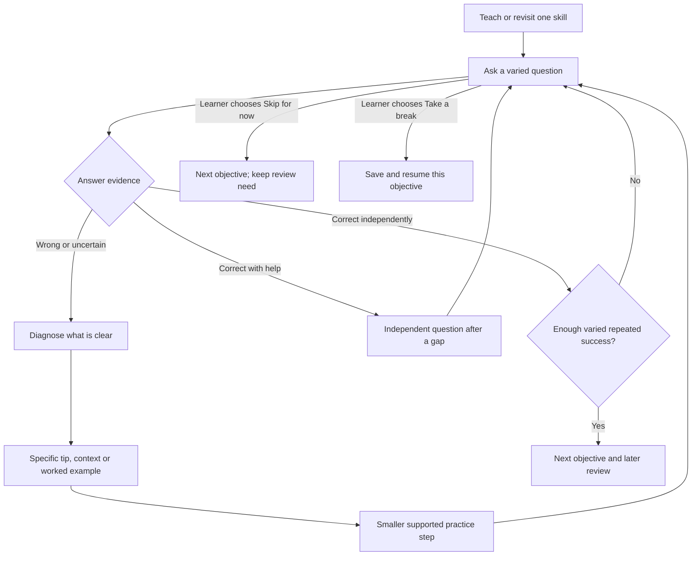

# Adaptive verb learning for Parola

Implementation design, 29 September 2026. Based on the [application audit](APPLICATION-AUDIT-2026-09-29.md) of `main` at `e6d33a9`.

The core course, evidence model, adaptive lessons, word practice, review, persistence and revision-checked sync are implemented on the review branch. The live application has not been changed. See [release notes](ADAPTIVE-LEARNING-RELEASE.md) for the delivered behavior, verification and rollout requirements. This document also records longer-term teaching aims; it is not a claim that software tests establish fluency.

## Product decision

Make **Everyday Italian** the default guided verb course. Organize it into **Present, Past and Future**, taught through focused practice that responds to the learner's actual mistakes. Retain the full dictionary and conjugation reference. Offer additional grammar as optional courses once the everyday course is complete, with an earlier opt-in for experienced learners.

**Required behavior:** a single correct answer never skips an objective. Each objective loops through teaching, varied practice and repeated independent checks until the learner demonstrates it consistently or explicitly chooses **Skip for now**. Errors change both the explanation and the upcoming exercises. The learner controls skipping and breaks; an arbitrary question limit must not advance them automatically.

“Past” needs two complementary forms: **passato prossimo** for completed events and **imperfetto** for habits, descriptions and ongoing background. Teach them in separate stages before mixing them. This is a practical curriculum choice, not a claim that Italian has only three tenses or that the remaining forms are unimportant.

The major simplification is *how much a learner must handle at once*. A1/A2 lessons already include these four forms, but currently put them all into each new verb walkthrough.

## The everyday course

| Category | Stage | Main objective | Examples |
| --- | --- | --- | --- |
| Present | 1. Now and routines | Present endings, key irregulars, person agreement, useful modal phrases | `Parlo italiano.` / `Voglio un caffè.` |
| Past | 2. What happened | Passato prossimo: auxiliary + participle; common irregular participles; agreement where the context requires it | `Ho mangiato.` / `Maria è andata a casa.` |
| Past | 3. How things were | Imperfetto; habitual/background past; contrast with a completed event | `Da piccolo abitavo a Roma.` / `Mentre mangiavo, è arrivata Anna.` |
| Future | 4. Plans and predictions | Futuro semplice, useful irregular stems; also recognize present tense used for scheduled plans | `Domani partirò.` / `Domani parto alle otto.` |

Within a stage, start with a few useful forms and add persons gradually. All six persons remain available in the reference; the course checks coverage over time. Do not force six flips for every familiar verb.

Use a finite set of **24 anchor verbs** to organize the course: essere, avere, fare, andare, stare, dare, dire, potere, volere, dovere, sapere, venire, uscire, mangiare, bere, parlare, alzarsi, lavorare, studiare, prendere, vedere, capire, dormire, arrivare. All exist as A1 entries in the current data. This is a proposed teaching set, not a corpus frequency ranking. Introduce modal compound constructions only with authored contexts that resolve the auxiliary choice.

Other selected verbs can supply extra practice. Finishing the course must never require completing all 1,185 dictionary verbs. New verb discovery still respects the user's list/topic/level scope; if a prerequisite is outside that scope, offer a clearly labeled foundation lesson rather than silently broadening it.

### Optional expansion after the course

Show: **“Everyday course complete. Keep practicing, or explore more.”**

Offer **Keep practicing everyday Italian** as the primary action and **Explore more forms** as the secondary action. Expansion modules can cover useful conditional requests, commands/imperative, progressive constructions, subjunctive, additional compound tenses and passato remoto. Passato remoto has real regional and narrative uses; optional here does not mean obsolete.

Recognize useful fixed phrases such as `vorrei un caffè` early when helpful, without making full conditional conjugation a core prerequisite. Keep citation gerunds and advanced morphology out of mandatory beginner completion.

An expansion must be explicitly selected before its exercises enter automatic lessons/review. Merely opening a reference table must not enroll the learner. Turning off an expansion preserves its history but removes it from the automatic queue and its due count.

## What the learner sees

Preserve Parola's typography, color, voice controls and celebration style. Simplify the lesson interaction to one active exercise with visible controls; animations may decorate learning but must not delay answering or be required to navigate.

**Learn screen**

> Today's practice · about 5–7 minutes  
> Past: choosing essere or avere  
> We'll revisit the auxiliary choices you found difficult.  
> **Continue practice** · Choose a topic

Below that, show three compact course categories: Present / Past / Future. “Past” contains its two stages. Keep the full reference as a separate action. Display descriptive skill states such as New, Practicing and Remembered later; avoid unsupported “92% fluent” scores.

**During a session**

1. Briefly explain one new objective when needed; experienced learners may choose a multi-question placement check. One successful check does not bypass teaching.
2. Ask a question and offer **Hint**, **I don't know**, **Skip for now**, and **Continue** controls appropriate to the state. Skipping a question is distinct from skipping the current objective.
3. Explain the specific mismatch; highlight the part that needs changing.
4. Select the next exercise using the answer and prior evidence.
5. Once the objective is demonstrated, show “Ready for the next step” and offer the next objective. When the learner finishes or pauses the session, summarize “What improved” and “What we'll revisit”.

Offer a break/checkpoint around 10 scored questions; this is not a hard session limit or a completion condition. The learner can **Keep practicing**, **Take a break**, or **Skip this step**. Practice continues while they choose to work on the objective, even when it takes more questions than expected. Pausing saves the unfinished objective and resumes it later. Introductory explanation cards do not count as tests. Duration is an estimate, not a timer.

### The repeat-until-ready loop



Example: the learner guesses `sono` correctly once. That is one recognition success. They still practice the construction, fill the auxiliary in a new context, produce the complete form without answer options, and answer again after intervening questions. If the later answer is `ho andato`, the auxiliary evidence remains unresolved and the lesson pivots back to auxiliary teaching. Successfully recalling the verb's meaning does not clear that issue.

## Concrete adaptation rules

| Observation | Immediate response | Later practice |
| --- | --- | --- |
| Writes `ho andato` for a simple first-person passato prossimo prompt | Explain that this use of `andare` takes `essere`; practice choosing the auxiliary with the participle supplied | Return to `sono andato/andata` after 2–4 intervening questions, then a related already-taught verb and a later-session check |
| Writes `tu parla` when `tu parli` is required | Contrast `tu parli` with `lui/lei parla`; focus on person endings | Mix tu/lui forms across familiar -are verbs; retain successful work on other persons |
| Writes `prenduto` for the past participle of `prendere` | Teach `preso` with an authored example | Revisit that irregular participle independently of regular participles |
| Chooses the wrong past form in a vetted contextual contrast | Explain completed event versus background/habit using the full context | Give a new contrasting example; do not treat one time word such as `ieri` as a complete tense rule |
| Omits an accent in otherwise correct `parlerò` | Show the accent correction; honor the user's accent-strictness preference | Track orthography separately; do not infer that the learner misunderstands future tense |
| Gets several multiple-choice questions right | Try a short independent typed response | Recognition supports the next step but cannot by itself establish production mastery |
| Uses a hint, reveals the answer, or plays answer audio | Record assisted practice | Schedule an independent check; no mastery promotion from merely copying the answer |
| Repeatedly misses the same skill | Change the teaching approach: isolate a component, show a contrast/worked example, then an achievable familiar item | Keep the objective active and rebuild toward independent answers; offer a break or explicit skip without marking it understood |
| Answers independently and succeeds again later | Brief confirmation and less frequent review | Add a new person/context or the next objective while retaining occasional retrieval |

Do not infer error type from timing alone. Slow typing, assistive input and interruptions must not lower mastery. Audio that *is the question* in dictation is different from audio that reveals the answer.

## Evidence and diagnosis

Record **every submitted lesson answer**, including quick checks and the final drill. Viewing a card is exposure, not success. Each attempt needs structured question metadata rather than parsing rendered text:

```js
{
  eventId, profileEpoch, deviceId, deviceSequence,
  sessionId, questionId, questionVersion, occurredAt,
  verbId, tense, person, targetSkills, componentResults, exerciseMode,
  acceptedVariantIds, contextId,
  outcome, assistance, firstAttempt,
  errorTags, diagnosisConfidence, elapsedMs
}
```

`outcome` distinguishes correct, incorrect, skipped and revealed. `assistance` distinguishes none, hint, visible form, and answer audio. Keep a short bounded recent-answer history locally when useful for “your mistakes”; derived metadata is enough for long-term skill tracking. Never store HTML, closures or complete generated question objects in the profile. Free text need not be synced for adaptation.

Maintain separate **recognition** and **production** evidence for each `verb × tense × skill` record. Persons and error categories are sparse subrecords created only when attempted. Shared pattern evidence, such as present -are person endings, can influence exercise selection; it must not automatically certify all related verbs.

Skills include meaning, finite form/person, auxiliary, participle, agreement, reflexive/clitic construction, tense selection in context, and orthography. Not every exercise diagnoses every skill. A missing subject-gender cue cannot establish an agreement error.

A compound-form answer can demonstrate a correct participle while using the wrong auxiliary. `componentResults` preserves both observations and only assigns them where the exercise supports that diagnosis. Contextual tense selection requires an authored contextual task; typing a form after being told its tense demonstrates formation, not tense choice. Readiness checks must match the objective they claim to assess.

### Diagnosis order

1. Normalize spaces, case, apostrophes and Unicode; evaluate all accepted variants.
2. Separate exact correctness, allowed accent differences, skipped/revealed answers and assisted responses.
3. Compare with known valid forms for alternative persons/tenses. Only assign a specific confusion when the evidence is unambiguous.
4. For authored compound exercises, compare auxiliary/person, participle and agreement separately. Apply clitic parsing only to supported constructions.
5. If multiple interpretations remain, use “needs practice” and ask a simpler diagnostic question. Do not invent a grammatical explanation from edit distance.

Multiple-choice distractors should have explicit diagnostic tags, but a selected distractor is a clue, not proof of a misconception. Repeated independent evidence makes a stronger diagnosis.

This can be a deterministic browser module. No LLM calls, paid inference service or network access are required for v1.

## Choosing the next question

Use an eligible candidate pool filtered by curriculum stage, explicitly enabled expansion, available form, ordinary usage/person constraints, content context and study scope. That filter must apply to fallback questions and distractors too. If a form is unavailable, select a different eligible example/verb for the same active objective. If none exists, explain the content limitation and offer an explicit pause/skip/choose-next action while preserving the unfinished objective; never advance automatically or silently switch to an advanced tense.

Use a continuing stream centered on one active objective. Across a rolling window of roughly 10 questions, aim for about six on that objective and four short retrieval questions on familiar/due material to space its checks. These are tunable starting defaults, not a fixed playlist or stopping rule. For a new learner with little prior material, vary the taught examples and smaller component skills. After recurring errors, pause introduction of further objectives and concentrate on the current difficulty. Successful completion or an explicit skip selects the next objective.

After each answer:

1. Save the attempt exactly once and update the applicable evidence.
2. If incorrect, select specific feedback and optionally schedule one focused repair.
3. Revisit the skill after 2–4 different questions. After two unsuccessful repair cycles, change the explanation/scaffolding rather than presenting the same correction again. Keep practicing unless the learner chooses a break or skips.
4. Prefer varied prompts and alternate verbs after two consecutive questions when suitable familiar alternatives exist. When they do not, vary supported contexts/components of the same verb. Spacing preferences must never force advancement from an unresolved objective.
5. Recompute the next eligible question; a session cannot be a fully prebuilt random list if later questions are to react to current answers. Never advance solely because a quota, retry limit or estimated duration has been reached.
6. Save the session cursor, curriculum version and queued repair objectives for resumption. Revalidate eligibility on resume after curriculum changes.

Keep one review schedule for the affected skill, not one schedule for the whole verb. Reuse the existing SRS calculation as a conservative first iteration, but advance its long-term interval at most once per skill per independent review session. Repeated correct answers moments after a reveal do not create multiple days of apparent retention.

Wrong or revealed answers bring the affected skill back sooner. Assistance gives practice credit but cannot lengthen a well-established interval. Independent success after a meaningful delay can advance the interval. Candidate initial review gaps are the app's current 8-hour/3-day steps; tune them using later recall rather than presenting them as optimal scientific constants.

## Progress and finishing

Separate **session completed**, **verb introduced**, **stage ready**, and **remembered later**. Preserve the legacy learned list for existing lists/games, while explaining that it means introduced/completed rather than every tense mastered.

Proposed initial rules, to validate with actual learners:

- A skill becomes **Practicing** when taught or attempted.
- A skill becomes **Ready for the next step** after at least four independent first-attempt correct production answers across at least two authored prompt variants, with the latest three qualifying first-attempt production checks correct. At least one successful check must follow 2–4 intervening questions. General rules also need transfer to another familiar verb; verb-specific irregular forms need varied persons/contexts where appropriate. Multiple-choice success, immediate copied corrections, identical repeated prompts and assisted responses do not satisfy the production requirement. The exact threshold is tunable; no small set of answers guarantees understanding.
- A recurring diagnosed misconception needs at least two subsequent varied independent successes on the affected component before it is cleared. Successes on other components cannot cancel it. An intervening error on that component restarts its confirmation sequence, while preserving successes on unrelated skills.
- A skill becomes **Remembered later** after meeting the readiness rule and succeeding on two varied independent checks in a later session at least 24 hours after teaching/repair. There must be no unresolved repeated misconception in the latest checks.
- At a stage checkpoint, check each required objective independently, using multiple relevant verbs and all six grammatical persons across the blueprint where those persons are ordinary usage. Auxiliary, participle, person, and contextual tense-choice weaknesses cannot be averaged away by meaning answers.
- A skill with unresolved repeated errors stays active. **Skip for now** immediately moves to the next step without penalty; record a deferred-objective decision, retain its evidence, and offer a focused revisit later. Suppress it from automatic selection for the rest of this session unless the learner selects **Resume**. Offer it in the next session's unfinished-practice list. This decision is neither a correct answer nor a forgetting lapse. If the next objective depends on it, provide a concise optional scaffold without blocking the user's decision to continue. A skipped skill is not “ready” and cannot satisfy the stage completion checkpoint until demonstrated later.
- **I don't know** reveals/supports the current question and keeps the objective active. **Skip for now** skips the objective. **Take a break** preserves the exact unfinished learning position. Give these actions distinct labels and records.
- Award everyday completion after the four stage checkpoint blueprints pass, including their delayed checks. Do not require all anchor verb/person cells to be mastered. Show the optional expansion invitation then, while allowing voluntary earlier access.

The checkpoint blueprint must enumerate required objectives before implementation: present regular classes/-isc/common irregulars and person coverage; completed past auxiliary/participle/agreement/reflexives; background past formation and contextual contrast; future regular/irregular stems and plans. A reviewed authoring file should specify at least two distinct verb contexts per general objective; verb-specific irregulars remain individual skills. These thresholds are product heuristics, not established efficacy claims.

## Persistence and compatibility

Add a versioned `verbLearning` domain to each profile, containing curriculum/enrollments, sparse skill summaries, recent evidence and resumable sessions. Keep the legacy `items`, XP, streaks, lists, custom entries and profile IDs.

On first use, migrate additively and idempotently. Existing learned verbs are **introduced; skill evidence unknown**, not automatically mastered or erased. Offer a short optional placement check so returning learners can move ahead. Export/import merge and replace, reset, profile switching and custom-verb deletion must all explicitly handle the new domain.

Give attempts stable unique IDs. Duplicate submission, retrying a save, importing the same backup twice or syncing twice must not count an attempt twice or award XP again. Keep XP credit separate from SRS/evidence recording so instrumenting existing checks cannot double existing rewards.

Device identity belongs to the installation, not the imported profile. Import historical attempts with their original IDs, but assign new attempts the receiving installation's identity and sequence. Finalize the checkpoint content and durable evidence merge/reset/compaction schema before implementing the reducer and migration.

For optional cloud users, current whole-profile last-write-wins merging is inadequate. Require a schema-aware merge of attempt identities and skill evidence plus **atomic server conflict detection/retry** for concurrent profile updates; merely pulling immediately before a blind push is not sufficient. A revision-checked update/RPC on the existing Supabase row is the preferred small-server change. Reject stale writers, refetch, merge and retry, with a visible retry state on failure. Existing setup SQL, backup handling and version compatibility must be updated together. Older clients must not overwrite the new domain.

Do not call this cross-device-safe until simultaneous/offline-device tests pass. Local adaptation itself remains offline and backend-independent. Event retention/compaction must preserve deduplication watermarks and reset epochs; never trim an event log in a way that resurrects old attempts or drops unsynced evidence. Bound recent raw-answer storage and compact durable summaries after acknowledged merge.

## Implementation map

| File/module | Proposed change |
| --- | --- |
| New `js/learning/curriculum.js` | Course stages, enrollment, eligibility, checkpoint blueprints and finite anchor set; lexical CEFR and grammar progression are separate. |
| New `js/learning/diagnose.js` | Variant-aware deterministic diagnosis and feedback selection with a safe unknown result. |
| New `js/learning/model.js` | Pure next-question selection, evidence reduction, skill schedules, mastery loop and break/skip state; injected clock/randomness for tests. |
| New authored lesson content | Context IDs, target skills/person/tense, accepted variants, prerequisites and reviewed contrast/repair prompts. Existing general examples remain reference material until tagged. |
| `js/games/questions.js` | Structured metadata, constrained fallback/distractors, contextual forms; reject unsupported/missing forms. |
| `js/games/engine.js` | Optional question-provider/attempt callback for adaptive sessions; retain array-driven games. Track assistance and prevent duplicate submission. |
| New `js/views/learnAdaptive.js` | Shared adaptive word/verb lesson with saved question recipes, assistance, feedback, spacing, breaks and explicit deferral. Original walkthrough remains available through the profile setting. |
| `js/views/learnVerb.js` | One objective at a time, focused repair and progress by skill; integrate auxiliary/participle only when needed. |
| `js/views/learn.js` / `home.js` | Next recommended objective, three-category course and accurate due counts. Avoid treating `seen > 2` as a reason to abandon an unfinished verb. |
| `js/views/review.js` | Eligible due skills with adaptive mode selection; bridge legacy verb reviews without inferring missing mastery. |
| `js/views/games.js` / `js/games/index.js` | Default to taught/active core forms. Explicit custom tense choices stay user-controlled; playing one does not silently enroll an expansion. |
| `js/store.js` / `js/sync.js` | Versioned persistence, import/export/reset, idempotency, conflict-safe merging and XP accounting. |
| `sw.js` | Precache new modules/content and bump the cache version for schema/content changes. |
| Tests/deployment workflow | Curriculum, diagnostics, selection, migrations and focused browser/offline regressions. |

## Delivery sequence and acceptance checks

1. **Curriculum boundary and content:** central filter; core-only automatic review; known context fixes. Verify a high legacy score cannot introduce subjunctive/passato remoto, including fallbacks, cloze and distractors. Preserve full reference access.
2. **Evidence and migration:** save checks without changing lesson ordering. Verify wrong auxiliary evidence survives refresh, profile switch, export/import and duplicate sync; old progress/rewards remain intact. Resolve cloud conflict handling before enabling the feature for synced profiles.
3. **Adaptive sessions:** replace verb-session selection behind a per-profile rollout setting. Verify a lucky correct answer cannot skip an objective; several recognition successes still lead to independent production; errors pivot to the correct explanation and repair; assisted answers do not promote mastery; an exhausted retry budget never advances the learner; repeated independent varied success does; explicit skip advances without granting mastery; pause/resume preserves the loop. Also check skill isolation and unavailable forms.
4. **Course milestones and expansions:** checkpoint coverage, optional placement, completion invitation, expansion opt-in/out and matching due counts.
5. **Rollout:** run the existing suite plus dedicated small-viewport, keyboard, reduced-motion, real iPhone Safari/PWA, offline reload and old-cache migration checks. The flag can restore the old lesson UI while retaining newly collected evidence; rollback must never delete learner data.

Measure delayed independent accuracy by skill, recurrence of the same error, hints needed, session completion/abandonment, and next-day return. A short in-session score increase is not enough to establish learning improvement. Start with local summaries and a small opt-in pilot; the design does not require uploading personal answer text.

Repeated retrieval and later checks are supported by learning research, but the proposed question mix, thresholds, anchor set and timings are hypotheses for this product. See [Roediger & Karpicke's retrieval-practice experiment](https://pubmed.ncbi.nlm.nih.gov/16507066/).

The proposed everyday tense coverage is consistent with the range described in the [Università per Stranieri di Siena A2 teaching guide](https://www.unistrasi.it/public/articoli/1241/Files/Guida_livello_A2.pdf), which also includes polite conditional expressions. It is a deliberately focused course, not a complete A2 qualification syllabus. The [CILS syllabus](https://cils.unistrasi.it/public/articoli/52/Linee_guida_cils_pdf.pdf) helps inform later extensions. [Accademia della Crusca's discussion of passato remoto](https://accademiadellacrusca.it/it/consulenza/ancora-sulluso-del-passato-remoto/241) supports treating it as useful optional content rather than obsolete grammar.
