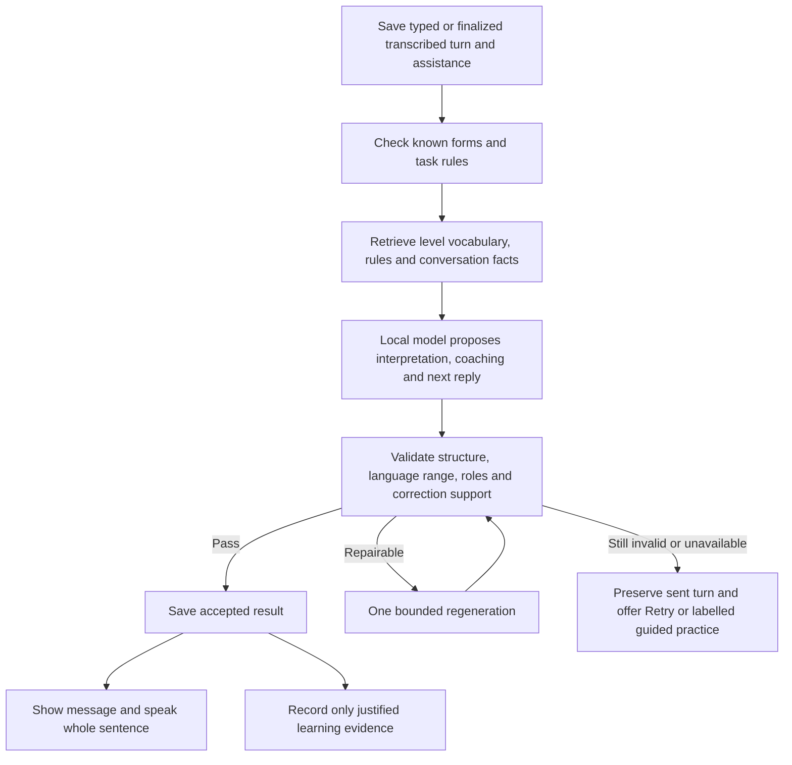

# Parola: unified learning, curriculum and offline conversation plan

Status: proposal for discussion, updated 3 October 2026 to include consistent accent handling, spoken conversations, Dialogue Coach, conversation study summaries and selective reconciliation of the additional audit attachment. No application implementation or deployment is included in this work.

Baseline: `main` at `bd60180cc4eea7d9c0bd45e41584048ec752fba1`. This plan combines [our application audit](AUDIT-2026-10-03.md), its [curriculum](audit-2026-10-03/curriculum.md), [learning](audit-2026-10-03/learning.md) and [system](audit-2026-10-03/system.md) reports, and the [independent seven-area audit at c9e9d7a](https://github.com/cmagripp/italianapp/blob/c9e9d7a/docs/AUDIT-2026-10-02.md). The independent audit was read from its branch; it was not merged into main. Model research is detailed in [the accompanying research note](plans/2026-10-03/offline-ai-research.md).

The extension is supported by [offline speech and runtime research](plans/2026-10-03/offline-speech-research.md) and the [application-wide accent audit](plans/2026-10-03/accent-policy-review.md). These are source/code reviews, not physical-iPhone benchmarks.

## 1. Recommended direction

Parola should become one connected learning experience: a structured course teaches Italian; words and verb cases build vocabulary and form knowledge; the workshop helps construct meaningful sentences; conversations turn that knowledge into interaction; a shared review system keeps it available. Every surface should agree about what is in progress, what is completed, and what needs practice.

Keep the distinctive visual design, compact word lessons, individual verb-case cards, reference tools, games, local-first operation and existing learner progress. Improve the learning and data contracts underneath them before adding a conversational model to the grading path.

The new conversation tool should generate responses to the learner's actual meaning. A finite selection of authored replies is a useful fallback, but it does not fulfill the requested dynamic conversation feature. The target remains fully offline, generated conversations at A1–C2, with graduated assistance and multiple participants. Availability at each level must follow language-quality and device tests; an untested small model must not be presented as a reliable C2 examiner.

Written, manually recorded and hands-free spoken turns belong to the same saved conversation. Dialogue Coach adds guided speaking practice, Italian explanations and word-finding help. Every thread has an always-available study summary linking its vocabulary, verb forms and corrections to appropriate learning and review. The confirmed defaults are natural spoken correction followed by continued conversation, and saved transcripts/notes with audio recordings retained only when explicitly chosen.

Start three strands together after approval: correctness and progress repairs; the curriculum rewrite; and a small real-device AI feasibility trial. Bring them together through shared interfaces. Do not postpone evidence-store performance until after adding long conversations, and do not make the whole curriculum wait for the model decision.

## 2. What the two audits establish—and what needs adjustment

| Area | Combined conclusion | Update required |
| --- | --- | --- |
| Learning and review | Separate objective IDs, completion flags and schedulers disagree. A game difficulty can remain due after its linked review; a later lapse can be hidden. | One objective registry, grouped review, consistent scheduling and preserved completion history. |
| Lesson pacing | Repetition is concentrated in similar prompts and scenes. Clean verb paths can still be lengthy; a fixed count does not describe every learner or verb. | Short visits, varied evidence, targeted repair and delayed consolidation instead of repeating a whole chapter. |
| Curriculum | Structural traversal works, but prerequisite coverage, everyday vocabulary, explanations and advanced skill breadth are insufficient. | A teach-before-test syllabus, editorial rewrite and skill-specific assessment through C2. |
| Workshop | Good interaction design sits above grading that silently repairs wrong forms and rejects some valid compounds. | Separate sentence-building assistance from assessment; add morphology, construction and meaning checks. |
| Navigation | Home, Learn, course and workshop do not share a continuation model. Labels can disagree with their destination. | One session summary and next-action service, consumed by existing views. |
| Persistence | Many fallback and update paths work, but a forced failure of both storage paths can still report success. Workshop free-entry drafts are not reliably saved. | Durable-save results, visible recovery and draft persistence before more generated content. |
| Performance | Boot eagerly loads substantial data; each answer repeatedly processes lifetime evidence. | Lazy loading, incremental indexes, merge-safe compaction and separate transcript storage. |
| Dictionary/reference | The sampled dictionary and conjugator are strong. Sense merging, accent rules and some generated exercises have structural faults. | Sense-aware records, targeted reference/morphology fixes and valid-alternative grading. |
| Existing AI | The assistant selects an authored reply; its trigger is unreachable in current dialogue content. The separate fit scorer is not a reliable correctness judge. | A new local dialogue service; retire misleading fit feedback and test actual inference. |

Several independent recommendations need changing to respect the intended product:

- **Short word lessons stay short and do not require typing.** Completing one is valid completion; it is not proof of unaided written recall. Recognition and retention can be measured through well-designed non-writing activities.
- **A whole verb still requires all five available core cases:** present, passato prossimo, imperfetto, future and conditional. True grammatical exemptions remain explicit. Present plus one past case is not enough for the whole-verb checkmark.
- **Existing checkmarks, manual selections and XP are preserved.** No mass downgrade of historical “learned” items to “introduced,” and no invented past evidence.
- **Review stays visible.** It can be available in Play and linked from Learn, but it should also remain an obvious option on Home.
- **Keep the immersive design.** Share behavior and controls without flattening every feature into the same generic screen.
- **Check linguistic claims carefully.** Rejecting a valid *vicino a* construction is a grading defect; *Il libro è nella casa* can be grammatical in a specific context; *Leggo più che scrivo* should not be declared universally ungrammatical. The latter examples need better context and teaching rules. [Crusca on vicino](https://accademiadellacrusca.it/it/consulenza/vicino-roma--vicino-a-roma/55), [Treccani on casa](https://www.treccani.it/vocabolario/casa/), [Treccani on comparison](https://www.treccani.it/magazine/lingua_italiana/domande_e_risposte/grammatica/grammatica_1668.html).

The additional pasted audit is an exact excerpt of the independent report already included above, rather than another independent measurement. Its useful detail is incorporated into the language-data, workshop, accessibility and maintenance requirements below. Existing coverage is retained without creating duplicate work packages. Its fixed Qwen default, exclusion of Gemma and initial “selects or writes English” restriction are superseded by the candidate research and Italian conversation requirements in Sections 7–9.

Neither audit measured learning outcomes or ran a real model on the stated iPhone. The independent review-queue simulation demonstrates a failure under its stated usage pattern, not a universal growth forecast. Browser timings are diagnostic measurements, not phone promises; even relative timings from a loaded host need repeated controlled runs. Automated overlap rectangles are not all visible layout bugs; reproduce them before changing the design.

## 3. One application, with clear roles

| Surface | Proposed role and visible changes |
| --- | --- |
| **Home** | One accurate Continue card; a small daily plan; Review due; an optional suggested next activity. Continue names the exact lesson, case, workshop or conversation it opens. |
| **Learn** | Keep the resume element. Keep My Course with course name, stage and meaningful completion count. Show the course path, Grammar and Vocabulary branches, and relevant Workshop/Conversation practice. Existing individual word/verb lesson entry points remain. |
| **Course** | A readable sequence of units with prerequisites, in-progress work across stages, placement, unit outcomes and contextual vocabulary. “Full lesson” and “Section” must actually do different things, or become one honest control. |
| **Words** | One dictionary/detail experience: senses, article/gender/plural, verb forms, usage, starred state and completion dropdown. Grammar reference and useful-word collections link into the same entries. |
| **Play** | Games, flashcards, Review, Sentence Workshop and a clearly visible Conversations entry. Keep open practice distinct from the guided course. |
| **Me** | Progress by course and skill; completed material; practice history. Put preferences, data export, cloud identity, voices and AI downloads in a settings sheet. |

Keep the current tab structure initially, including the reviewed Learn dial and Workshop/game reels where they remain useful. Remove duplicated decisions and dead controls before removing whole navigation views. Use one definition each for **course stage**, **practice level** and **study scope**; do not display all three as if they were the learner's measured proficiency. A vocabulary completion ring is not a CEFR proficiency score.

Home and Learn consume the same ordered daily plan and exact resumable-session description. Update that plan after completion, pause or a changed time budget; interleave due targets without an endless review-first loop or an arbitrary backlog that blocks new learning. Opening a preview alone must not create an in-progress lesson; begin its durable session on Start or the first learning interaction.

The shared lesson shell owns viewport fitting, back/history, pause, progress, information dropdown, help, feedback and completion actions. Each activity keeps its appropriate layout: matching boards, horizontal example cards, sentence construction and chat bubbles. Preserve centered horizontal rails and outlined action controls where already successful. Never require scrolling the outer page to reach Continue; long material scrolls inside its own area. Respect safe areas, keyboard height, larger text, zoom and reduced motion.

For progress, show stages such as “Present · Practise” and a meaningful visit-progress indicator. Keep the denominator stable within the current visit; show an added repair as “A little more practice,” rather than unexpectedly expanding a fraction. The unit and case completion states remain visible separately.

## 4. A single learning and review model

### Completion and evidence are different facts

**Completion** records that a word lesson, verb case, course lesson or workshop was finished, or manually marked complete. **Evidence** records what the learner did: recognition, construction, unaided production, listening or delayed retrieval; whether help was used; the particular error; the context; and when it happened.

A choice answered correctly after a hint is useful practice. It must not become unaided mastery. A learner who deliberately avoids writing can still build and demonstrate delayed recognition. A typed answer is required only when the stated objective is written production. Ordinary conversation participation is not automatic evidence for every grammar construction appearing in the transcript.

Keep manual completion/uncompletion dropdowns, including all/individual verb cases. Manual completion makes those cases eligible for a gentle review; it does not fabricate successful attempts. Unlearned cases do not enter the review queue merely because another case of that verb is complete.

### Canonical objectives and a manageable queue

Every assessed activity declares a canonical target, sense or verb case, evidence mode, assistance state and review destination. Map legacy IDs only when they represent the same skill. Preserve other old difficulties with a valid diagnostic destination; do not silently discard them.

Show one review row per word, verb case or grammar lesson, with a short session covering its due targets. A review answer must update the exact difficulty that caused it to be due. Study scope can filter new practice; it cannot erase already due work. Successful recognition should lengthen the recognition schedule appropriately rather than continually lowering ease because the learner did not type.

Proposed pacing defaults for user testing:

- Word introduction: brief meaning/usage, then roughly 4–6 varied recognition interactions; optional extra practice and writing challenge.
- Verb case: short teaching and examples, then roughly 6–10 meaningful interactions per visit. Larger cases can have a second clearly resumable visit. Completion requires coverage and evidence, not just reaching a cap.
- Repair: explain one error, provide a contrast, ask 1–2 fresh targeted checks, then return to the activity. Repeated difficulty offers more practice, easier support, pause or skip; it does not trap the learner.
- Review: a short mixed batch with a visible stopping point, expandable by choice. Use delayed checks to consolidate; do not replay the entire original lesson for every due person/form.

These are design starting points, not fixed quotas or measured durations. Matching the last remaining forced pair does not count as an independent demonstration. Vary verbs, people, context, task and delay; do not turn a single lucky guess into a shortcut past teaching.

Use stable award IDs for rewards, retain existing XP, and balance new awards prospectively. Before migration, define one award table for completion, assisted practice and assessed evidence, including replay and duplicate-credit rules. Do not adopt the audit's production-heavy points formula as a requirement. A learning streak should reflect actual learning activity, with historical counts preserved rather than silently rewritten. The daily plan balances due work and new material and respects the learner's chosen time budget.

Initially, free-chat text and model praise earn no correctness XP, CEFR advancement, retention or lesson/case completion. A constrained conversation exercise can earn the same credit as its equivalent lesson exercise only through the canonical objective policy. Conversation time may appear in practice history without being presented as assessed mastery.

### Consistent accent handling everywhere

The existing **Strict accents** setting becomes one shared submission policy across word and verb lessons, grammar/course lessons, placement, review, typed games, workshop activities and written conversation checking. Every current and retained legacy entry point must use it; a newly added activity must not invent its own comparison rule.

With Strict accents **off**, an accent-only difference from a valid answer is accepted normally. On Submit/Check/Send, the visible answer updates to the correctly accented spelling in the same field or bubble: **caffe → caffè**, **perche → perché**. Briefly highlight the restored character and, when useful, show a small “Accent added” note. Speak the correct form or complete sentence. This needs no extra confirmation, retry or second answer. Do not replace the word while the learner is still typing.

With Strict accents **on**, an accent difference receives appropriate spelling feedback and the existing correction/retry flow. Treat composed and decomposed Unicode forms equivalently. Keep accepted variants, capitalization and apostrophe policies explicit and separate from accent tolerance.

The comparison result must preserve the original input, the matched valid answer, accent-only changes and the setting at submission time. Display canonical accents without silently replacing person, tense, agreement, word order or meaning. Under the permissive setting, restoring accents does not penalize otherwise successful vocabulary/grammar practice; it does not demonstrate independent accent spelling either. Past evidence must not be regraded when the setting changes.

Apply tolerance to **typed text**, not to explicit answer choices. Selecting *e* (“and”) rather than *è* (“is”) in a meaning/choice question remains incorrect. If an activity specifically teaches written accents, keep the setting consistent for typed answers and use sound, meaning or visibly different choices to check the distinction; do not quietly override the setting or claim accent mastery from automatic restoration.

For a known-answer sentence, its accepted forms disambiguate *e/è*, *si/sì*, *da/dà* and similar pairs. In open conversation, use a supported contextual interpretation; never accent every occurrence of *e* or change a valid word simply because an accented homograph exists. If the meaning is ambiguous, ask a brief clarification. An accent-only restoration can be automatic; an uncertain semantic correction cannot.

Speech recognition supplies its own spelling and accents. Those are not the learner's typed choices: do not mark a spoken answer wrong because the recognizer omitted an accent, or award spelling mastery because it inserted one. This is separate from acoustic stress/pronunciation assessment. An explicit keyboard edit to a transcript remains distinguishable from the recognized text.

Release fixtures cover Strict on/off in every typed activity family, Enter versus button submission, alternative correct sentences, uppercase and Unicode accents, *caffe/caffè*, *perche/perché*, contextual *e/è*, unchanged conjunctions, strict multiple-choice distinctions, voiced answers, reload and profile switching. Verify the displayed corrected answer as well as the success flag.

## 5. Rebuild the course from zero through C2

### Curriculum structure

Build a curriculum map before rewriting packs: communicative outcome → required vocabulary senses and constructions → teaching → guided use → independent transfer → delayed review. Words and grammatical forms are introduced before being required, including reserve questions and repair paths. A noun's meaning being available in a tooltip does not establish that it was taught.

The following is the proposed progression spine; exact unit boundaries and language inventories receive Italian editorial review. CEFR outcomes include reception, production, interaction and mediation, so the course cannot measure progress through grammar choices alone. [Council of Europe descriptors](https://www.coe.int/en/web/common-european-framework-reference-languages/cefr-descriptors).

| Stage | Everyday world and language development | Evidence and integration |
| --- | --- | --- |
| **Foundations / absolute beginner** | Greetings, names, essential classroom/help phrases; hearing and reading Italian sounds through a tiny known word set; first meaningful chunks; basic subject and gender awareness. | Listen, see, understand, match and use a known phrase. A first supported greeting conversation. No test that requires an unexplained word such as *chilo*. |
| **A1** | Personal information, family, home, daily routine, food, shopping, time/dates/numbers, places/directions, work and leisure, clothes, weather and basic health. Present, questions/negation, articles/gender/plural, agreement, possessives and common prepositions; useful requests and formal *Lei*. | Short transactions, descriptions and exchanges with known words; linked word sets and relevant verb cases; simple supported chat and listening. |
| **A2** | Travel, services, appointments, plans, experiences and connected everyday accounts. Full coverage of the persons used in past/future work; completed events versus background/habit, progressive contexts, pronouns and polite conditional requests. | Understand and tell a short account, handle routine changes and repair misunderstandings; mixed past practice and context-sensitive workshop tasks. |
| **B1** | Independent everyday interaction, narratives, explanations, advice, preferences and opinions; richer links between clauses, pronouns, tense relationships, conditionals and common subjunctive uses as appropriate to the syllabus. | Unseen situations, sustained exchanges and short connected writing; earlier forms retrieved rather than first appearing in a typed test. |
| **B2** | Detailed argument, viewpoints, hypothetical situations, register, reported speech, passive/impersonal choices, cohesion, idiomatic uses and more nuanced grammar. | Varied longer reading/listening, defend and qualify opinions, negotiate with multiple speakers, revise writing with a rubric. |
| **C1** | Implicit meaning, stance, complex discourse, nuanced register, professional/academic communication and mediation across sources. | Fresh extended texts and natural audio; summarise, synthesise, negotiate and produce well-organised arguments with specific feedback. |
| **C2** | Fine shades of meaning, irony/ambiguity where context supports them, sophisticated style, difficult listening, precise reformulation and flexible interaction. | Varied unseen material, demanding mediation and interaction, substantial production and reflective review. Course completion remains distinct from certified proficiency. |

Each stage needs an inventory of useful senses, phrases and grammatical constructions, with exposure and retrieval mapped over time. Word counts are editorial coverage indicators, not CEFR certification thresholds. Include function words and frequent multiword expressions as well as nouns and verbs. Broaden names, settings, intentions and cultural situations so every exercise is not about Anna or Luca buying the same object.

### A lesson should build in small steps

1. State one useful outcome: “Ask what someone wants to drink.”
2. Introduce the few necessary words or chunks, with meaning, sound and relevant forms.
3. Demonstrate the pattern in a clear scene; show why it is useful.
4. Guide recognition or construction with visible support.
5. Remove part of the support and vary one aspect of the situation.
6. Explain errors specifically, then revisit the same skill with a fresh example.
7. Use it in a short workshop exchange or conversation where appropriate.
8. Recap what was covered, offer related words/verb cases, and schedule a later check.

A pronunciation lesson first plays known examples and contrasts the target sounds; it does not merely ask which letters appear. A soft/hard-*c* lesson might introduce *casa* and *cena*, teach their sound contrast, practise listening, and only later introduce *chi/che* with fully explained examples. Avoid asking the learner to infer both vocabulary and the pronunciation rule simultaneously.

Repair content must match the error: an elision mistake receives an elision example; negation receives a negation contrast. Expand small repair banks so a second error does not force an eight-hour dead end. Offer a guided re-teach when independent variants run out, recording the support honestly.

### Verbs and words within the path

Retain the five verb cases and fold present *stare + gerundio* into the present journey where the verb's meaning supports it. Use the verb being learned; do not teach *viaggiare* through an unrelated *mangiare* replacement. After teaching the progressive, mix simple present and progressive in context before the present recap. Explain state/meaning exceptions instead of forcing every verb into an unnatural progressive.

Teach regular participle and gerund patterns with verb-specific exceptions: *-are → -ato*, usual *-ere → -uto*, *-ire → -ito* for participles; *-are → -ando*, *-ere/-ire → -endo* for gerunds, with explicit forms such as *detto* and *dicendo*. Connect *sto mangiando*, *stavo mangiando*, *mangiavo* and *ho mangiato* to context and aspect rather than presenting interchangeable English glosses. Teach formal *Lei* among the other persons, distinguish it from third-person *lei* in context, and cover plural forms before requiring them.

All verbs use the same audited rules and coverage checks. High-frequency, irregular, reflexive, impersonal, idiomatic, dual-auxiliary and progressive-sensitive verbs receive individual editorial review. Templates may propose examples, but they must not publish implausible subject/verb/object combinations. A shorter path for a familiar regular pattern still checks the new verb's meaning and forms.

Word lessons remain mainly matching and choices, with article/plural and relevant senses. Matching cards speak on selection and turn over without changing the board's geometry. Correct sentence activities speak the complete sentence. Use diverse exercise types where they serve the objective, including blanks, meaning choices, listening, matching, ordering and optional letter/word construction. Randomly changing the interface without changing the skill or context is not meaningful variety.

### Editorial pipeline

Audit all 256 current lessons and their repair/review variants. Preserve strong authored lessons; repair, merge or replace weak ones with explicit old-to-new mappings. Start with Foundations/A1 and prerequisite failures, continue through A2/B1/B2, and build advanced breadth in parallel.

Generators become authoring aids and validators, not autonomous publishers. Each lesson has named outcomes, known prerequisites, valid alternatives, error-specific explanations, natural examples, audio provenance, independent variants and a review owner. Add authentic licensed dialogue/interviews and varied longer material at higher levels. Synthetic audio may support early practice but does not replace exposure to natural speech.

Maintain a coverage report for each unit's new senses, forms, prerequisite teaching, contexts and later retrieval. Use the audit's lexical budgets and repetition counts as warning signals, not rigid CEFR quotas. Familiar contexts can deliberately recur for spaced practice; assess transfer with fresh contexts too. A requested Show answer may reveal the answer and record assistance. Remove empty echo-teaching steps only after replacing any explanation or prerequisite they were meant to provide. Estimate lesson duration from representative learner trials as well as step counts.

Fix the verified answer/explanation problems immediately: *vicino a* alternatives, *veduto*, the pizza/casa explanation, untaught *vuole/deve*, incomplete plural paradigms, *ce ne* functions, repeated echo teaching, malformed spoken elisions and ambiguous distractors. Native Italian review adjudicates contextual and stylistic disputes; passing JSON/schema tests is insufficient.

## 6. Upgrade the sentence workshop and lesson assistance

The workshop becomes the bridge from rules to conversation. Preserve its cards and construction controls, but provide two clearly different modes:

| Mode | What the user is asking | How it is assessed |
| --- | --- | --- |
| **Practise this pattern** | Produce a form or sentence under a stated constraint. | Assess the actual submitted form. A wrong agreement cannot be silently repaired and called correct. |
| **Help me say it** | Express an intention, including an English word or an unfamiliar form. | Offer a verified construction and explain the change. Record assisted learning, then optionally ask for a fresh independent use. |

First fix compound forms, time phrases, slot category rules, person/gender/number agreement, auxiliary choice, negation and valency. Accept legitimate alternative expressions and word orders when the task allows them. Keep the original learner text beside any suggested revision. Classify feedback as an error, a valid alternative, an optional naturalness suggestion or an uncertain judgement.

Regression cases include auxiliary-plus-participle input, existing *ho/sto/sono* wrappers, multiword time expressions, comparative duplication and predicate-noun agreement. Keep agreement controls available inside the player, update the English gloss when a free entry changes the sentence, and make a reaction's next turn fit what was actually said. Validate slots against their construction and meaning rather than banning all negation, quantifiers or adverbs. An English-to-Italian build shows the resulting form as assistance; it is not silently counted as correct Italian production.

Retire the current learner-facing fit score until it has a valid use and evaluation. A word's masked-language likelihood is not proof that its sentence is correct. Do not activate the current assistant merely by adding a second generic reply and declare the AI work complete.

The new local AI service can help interpret an intention, propose a sentence using verified language, explain a detected mistake with a relevant rule, vary a practice scene and continue an exchange. Lessons use the same service for “Explain this another way,” contextual examples, a targeted hint and optional fresh practice. It retrieves the lesson's rules and known vocabulary rather than inventing the syllabus. Assessed generated drills require a validated answer and objective; uncertain generated examples remain optional practice and never determine completion.

## 7. Conversations: the complete proposed experience

### Inbox and setup

Open **Conversations** from Play, a related lesson, the workshop or Home's resume card. The inbox shows saved threads with title/topic, participant names, last message, level and support mode. Continue any thread; start a new one; rename, archive, delete or export a conversation. Leaving saves the draft and exact learning state.

Setup is a compact sheet using existing controls:

| Setting | Proposed behavior |
| --- | --- |
| **Your name** | Prefill from the profile if available; editable and optional. Use a neutral greeting when omitted. |
| **How to address you** | Masculine agreement, feminine agreement, or wording that avoids gendered descriptions. Explain that this affects Italian forms; never infer it from the name. Allow changes later. |
| **Language level** | Absolute beginner support and A1–C2. The selected level sets the upper vocabulary/construction range and includes lower levels. |
| **Support** | Guided choices; supported typed blanks; free reply. These are independent of CEFR level and can change during the conversation. |
| **Response mode** | Write; tap to record; hands-free speech. Switch within one thread while preserving its draft and learning context. |
| **Practice style** | Conversation or Dialogue Coach. Coach adds a small speaking goal and more deliberate teaching while keeping the exchange natural. |
| **Corrections** | Natural spoken correction and continue by default; pause and explain; or save corrections for review. Change at any time. |
| **Topic** | Introductions, café/restaurant, shopping, travel, directions, daily life, family, work, plans, past experiences, opinions and level-appropriate scenarios. General begins with “Ciao! Come stai?” and follows the learner's direction. |
| **Participants** | “You + 1” by default; propose 1–3 AI partners initially, subject to device and quality testing. A counter changes the number; each partner has a visible name and stable role. |
| **Address/register** | Friendly *tu* by default; *Lei* when the chosen situation calls for polite address. An optional setup control allows explicit practice. |

Support mode does not silently raise or lower the language ceiling. Topic complexity adapts to level. For an absolute beginner, the opening greeting includes its meaning and a guided first response; it is not an unexplained A1 test.

The ceiling applies to partner messages, examples and scaffolds. A learner may use a correct higher-level expression without being marked wrong. Changing a name, agreement preference or level affects future turns and preserves the original transcript. Keep-open keyboard behavior is the default where the device permits it.

### One turn

1. A partner's Italian message appears in a bubble and the entire message is spoken. English meaning is available according to support settings; every Italian word or relevant phrase can be inspected.
2. The composer offers the selected response mode. Choices respond on tap; cloze mode accepts typing, suggested words or “Use my own word,” including semantically valid alternatives; free mode permits a complete typed reply. Quick controls offer more help or a challenge within the same CEFR ceiling. Help can reveal a keyword, frame, translation or example without forcing it on the learner.
3. On Send, save the exact text and assistance state before checking or generating anything.
4. If a meaningful target error is found, show one concise correction note adjacent to the message. In the default natural style, the partner can recast and continue without waiting for a tap or retry; review-afterward leaves a non-blocking note. Pause-and-explain explicitly offers retry, help or continuation. Preserve the original; never pretend the corrected version was the learner's unaided answer.
5. The partner responds to the intended content, including information the learner introduced. A correction must not make the conversational reply ignore the learner's question.
6. Repeated difficulties can trigger a brief targeted activity or a later natural revisit. Return to the conversation after it. Record only evidence the activity actually supports.

Optional **Pause and explain** example, with masculine agreement selected and the learner choosing Retry. Dialogue Coach uses Italian wording; English is available only through an explicit translation request:

> **Giulia:** Ciao Caleb! Come stai?
>
> **Learner:** Sono stanca.
>
> **Coach:** Al maschile si dice: **Sono stanco.** Vuoi riprovare?
>
> **Learner retries:** Sono stanco.
>
> **Giulia:** Capisco. Vuoi riposare un po'?

The corrected repeat is assisted evidence. A later fresh opportunity can show independent recall. If the learner chooses “tired” through Help me say it, teach *stanco/stanca* without first presenting the request for help as a wrong answer.

After a natural interval, offer a quiet recap—new words, patterns practised and one suggested next step—with **Keep talking** and **Finish for now**. There is no fixed conversation length or forced end. Pausing and returning preserves the thread rather than starting an unrelated script.

### Word lookup and learning a new word

Tap a word/phrase in either side of the conversation to see its contextual meaning. Nouns show article, grammatical gender and plural, or the relevant invariant/uncountable note; verbs show lemma, form, person, tense and useful construction. Resolve multiword phrases and clitics rather than blindly translating isolated tokens.

**Use this word** inserts a verified, semantically fitting term immediately. If it exceeds the level ceiling, request a visible scoped exception—“Use this word in this conversation”—without lifting the whole conversation's level. No teaching screen, checks, list save or completion change is required to use it.

**Learn this word** optionally opens a compact teaching card with meaning, forms, pronunciation and an example, followed by a couple of short non-writing recognition checks and an explicit save-to-list action. Merely looking up or using a word does not mark its lesson complete. Switching between choices, a blank and free reply preserves the current draft.

For a word outside the verified offline lexicon, offer a known synonym or a way to express the idea. The learner may save a custom note, but an unverified model guess must not become an authoritative dictionary entry, article or plural.

Free replies can still contain an unknown word or proper name. Preserve it and ask for clarification when needed; do not reject an otherwise meaningful message solely because the word is absent from the app's dictionary.

### Multiple participants

One local model manages the scene; there is not a separate model in memory for each partner. The app stores stable participant IDs, names, agreement preferences, roles, relationships and the current addressee. Keep speaker attribution visible and use names as well as color. Normally one person answers, with an occasional second contribution when it helps the exchange.

The “You + N” counter counts active partners. If later controls allow adding or removing someone mid-thread, display the join/leave event before changing the count; a generated extra name must not silently create a participant.

The learner can address one person or the group. The engine must distinguish *tu*, formal *Lei*, *voi*, third-person references and group agreement. Support grammar alternatives when the sentence is quoted or refers to another person; the learner's profile gender is not a blanket filter over every adjective in a message. Participants do not change identity or invent facts about the learner to fill context gaps.

### Visual and keyboard behavior

Use the current aurora background, typography, color palette, glass surfaces and controls. Add restrained message bubbles, compact speaker labels and inline learning cards. Do not recreate WhatsApp's branding or add unrelated social features.

The header and composer remain fixed within the app viewport; the conversation history scrolls internally. The bottom-right arrow hides the keyboard; tapping it again focuses the composer to request the keyboard. Preserve focus after Send where iOS permits it. The operating system controls the keyboard, so the app cannot guarantee it stays open across backgrounding or system interruptions.

Use the existing visual-viewport handling and safe-area strategy, tested on the actual device. Avoid new hard-coded iPhone heights. Lookup and help sheets must not strand the composer behind the keyboard. If the learner scrolls back, stop auto-scrolling and show a new-message indicator. Controls remain usable with large text and VoiceOver; new bubbles and feedback use restrained live announcements.

### Spoken conversations in the same thread

Every spoken turn appears as a message, with its transcription, any accepted revision and linked learning notes. Partner replies are visible and spoken in full. Switching between typing and speaking never creates a second disconnected conversation. The same topics, participants, cumulative level ceiling and lookup tools apply.

Guided speech can invite the learner to say a suggested option, supply a missing word or speak the complete reply. Read the short prompt aloud and assess the requested unit, without making a one-word blank answer look like an incomplete conversation sentence. More support or a free spoken reply remains available within the same turn and language ceiling.

**Tap to record** provides Start recording → Stop → read/edit/re-record the transcript → Send. Stop does not secretly send. Display partial transcription when the selected runtime can do it reliably, clearly labelled as provisional; otherwise show recording activity followed by the transcript. Keep a visible timer, recording indicator and Cancel. The learner can request a replay while temporary audio is still available and explicitly choose Save recording.

**Hands-free** starts with one deliberate Start action and microphone permission. While the conversation is active in the foreground, the app listens, detects a completed turn, transcribes, checks, replies aloud and returns to listening without another tap. It shows clear Listening / Finishing your sentence / Thinking / Speaking / Paused states, and always offers a large Pause/End control.

Silence detection identifies a possible turn ending, not necessarily a completed thought. Combine voice activity, a configurable waiting interval and available transcript cues. Allow slower beginner hesitation, self-correction and longer explanations. Offer a simple “Give me more time” preference. Do not dispatch every short pause, fill silence with invented text, or mistake “ehm” for a complete answer. Merge audio chunks into one utterance with overlap deduplication; a processing chunk limit must not become an arbitrary limit on how long the learner may speak.

Start with reliable automatic turn-taking: the learner speaks, then the partner speaks. Separately test **spoken interruption of the partner** with echo cancellation, speakerphone and headphones. Enable it only when the app can distinguish the learner from its own voice and stop playback without losing the learner's first words. A hands-free mode with alternating turns is useful; simultaneous interruption is a distinct capability and must be described accurately. If interruption is unavailable on a device, keep a visible stop control and clear turn states rather than letting the app answer itself.

Foreground hands-free conversation is the scope. Leaving the screen, switching profiles, locking the phone or receiving an audio interruption pauses safely and releases microphone access as appropriate. Do not promise a continuously listening background assistant. On return, show Resume and any durable draft; do not silently restart the microphone.

### Correction styles and recognition uncertainty

The user confirmed **natural spoken correction and continue** as the default. For example, after a verified learner utterance *Ieri ho andato al mercato*, the partner might say: *Ah, sei andato al mercato! Che cosa hai comprato?* A linked note can show the learner's corrected first-person form, *Ieri sono andato al mercato*. A repeated difficulty may receive a brief *Si dice…* clarification. The conversation keeps responding to the learner's meaning. Adapt the actual vocabulary and question to the selected level and known material.

**Pause and explain** gives one brief rule or contrast, invites an optional spoken retry, then returns to the topic. Intervene at a natural clause or turn boundary after a stable recognition result, not over an unfinished word or an unstable partial transcript. **Review afterward** keeps the spoken exchange flowing and puts supported correction notes in the summary. Corrections remain available visually in every style; use a cooldown and focus on important or recurring issues rather than explaining everything at once.

Keep three things separate:

- **Recognition uncertainty:** “Ho capito … È questo che volevi dire?” Offer repeat or transcript correction. Do not record a grammar failure while the recognized word is uncertain.
- **Language correction:** a supported issue in the confirmed wording, such as agreement, a verb form or a missing construction. Preserve negation, quantities, names and intended meaning.
- **Pronunciation coaching:** listening and repeating are available, but a pronunciation judgement needs separately validated acoustic evidence. A good transcript, low recognition confidence or successful word alignment does not by itself prove correct or incorrect pronunciation.

The recognizer should aim to preserve learner wording, including nonstandard grammar, without a separate “make this fluent” rewrite. Test whether it silently repairs mistakes; its output is a hypothesis about the audio, not an exact record guaranteed by the model. Allow “That's not what I said” by voice or button. Revising the transcript invalidates any correction or evidence derived from the misrecognition and updates the summary.

### Dialogue Coach in Italian

Dialogue Coach is a teaching style within Conversations, available with either recording mode and with typing as an accessible fallback. Choose a goal such as introductions, describing your day, telling a past event, asking politely or explaining an opinion. Give a short model, invite the learner to speak, respond to the meaning, teach one useful point, then create a fresh chance to use it. Keep the lesson bite-sized and resumable, with an optional recap instead of a forced end to the thread.

Coach speech, examples and explanations stay in Italian by default. When the learner does not understand, first use a shorter sentence and familiar words, then a concrete example or contrast, then a small choice or visual word card. Slow or repeat the audio when requested. Do not merely repeat the same definition more loudly or add harder synonyms. An explicitly requested translation remains available as an escape route; never switch to English automatically after a fixed number of attempts.

Keep Coach's live correction notes in Italian as well; general navigation follows the app's language preference. Dictionary translations remain available only when the learner deliberately reveals them. Requests such as *Non capisco*, *Ripeti* and *Più piano* can be handled within the active exchange without requiring a button. Distinguish a request from a quoted phrase before treating it as a control.

Word finding is a first-class teaching action. Recognize expressions such as *Come si dice…?*, *Non so la parola…* and a description of the missing idea, even if the learner mixes languages. Ask a brief clarifying question when several meanings fit, retrieve a verified dictionary sense, teach it and continue the conversation.

For the “person I live with” example, establish whether the learner means a partner, someone sharing the apartment or specifically the bedroom. For a housemate, teach **il coinquilino / la coinquilina; i coinquilini / le coinquiline**, with an Italian example such as *Marco vive con me. È il mio coinquilino.* If needed, explain through two concrete sentences and a simple comprehension choice. The referent's gender determines the noun form; the learner's own agreement setting must not change everyone else's description. A new target word can be a visible, scoped level exception, while its explanation uses familiar language.

Invite a natural use of the discovered word, but do not force a full word lesson before allowing the conversation to continue. Add it to the conversation's study summary with a Learn action. At advanced levels, Coach can help with precision, register and reformulation; those capabilities still need independent Italian evaluation rather than assuming a small model can judge every nuance.

### A living study summary for every conversation

Every written, spoken or mixed thread has a persistent **Summary** control in its header and inbox menu. The page exists from the first message and updates after each finalized turn; there is no need to finish the conversation to use it. Opening it during hands-free practice pauses listening, then returns to the same place.

Show a concise overview plus expandable sections for:

- **Vocabulary and phrases:** contextual senses, article/gender/plural, examples from the conversation, new discoveries, existing known words and starred items.
- **Verbs and constructions:** lemma, actual forms/cases encountered or practised, meaning, and links to the appropriate case lesson.
- **Corrections and useful contrasts:** original wording, supported revision, a brief explanation and whether the issue was retried. Recognition errors are labelled separately and do not become learning weaknesses.
- **Your practice:** supported versus independent checks, recurring difficulties, successful later uses and suggested next practice.
- **Notes and saved audio:** learner notes and only those recordings explicitly chosen for retention.

Each item links back to its source message or correction. Deduplicate by dictionary sense and construction while retaining the examples. Distinguish language produced by the learner from language supplied by the partner; neither mere exposure nor a lookup becomes completed learning. Filters keep the initial view useful, with the fuller encountered vocabulary available to inspect.

Actions include **Learn this word**, **Practise these words**, **Learn this verb case**, **Review this difficulty**, **Add to my vocabulary**, star and the existing manual completion dropdown. A short word lesson or a qualifying verb-case activity updates the normal vocabulary/progress system; explicit manual marking also works and retains its manual source. Adding a word to a collection does not quietly mark it learned. Practising one verb form cannot complete unrelated cases. A request to learn an unlearned case starts its lesson; ordinary review remains limited to learned/eligible cases.

Offer a short selected-item practice set or a mixed set for the conversation, with matching, choices, blanks and optional spoken production. Use the same canonical objectives, accent policy and review scheduler as the rest of Parola. Keep short word practice non-writing by default. Recognition, speaking and typed spelling remain different evidence modes.

The summary index updates deterministically from final messages, verified lookups and learning events; an optional AI overview cannot invent words, corrections or claims of mastery. Show a saved revision/message watermark while an overview is catching up. Transcript edits, deleted turns and rejected misrecognitions update dependent notes and evidence consistently. Preserve fictional partner statements as conversation context, not facts about the learner.

The confirmed storage default is **transcripts and learning notes only**. Temporary audio may be buffered in memory for recognition, retry and explicit Save recording; discard it when no longer needed. A recording that was not saved cannot be recovered after the app closes. Persist available transcript drafts, but do not claim that unsaved audio or untranscribed speech survives a crash. Saved audio receives an explicit delete/export option and stays local unless the user deliberately enables another destination.

## 8. How the AI should work

### Level control requires more than a prompt

Use an editorially maintained language profile for each level: allowed word **senses**, constructions, inflected forms, register and complexity. The dictionary's current CEFR labels alone are insufficient, especially where common and rare senses have been merged. CEFR is a capability framework; Parola must define and review its own concrete language inventory.

For each turn, retrieve a compact selection of appropriate words, patterns and rules. Supply the learner's known material, recent mistakes, chosen support, scene and recent exchange. Then validate the proposed reply against vocabulary and constructions before displaying or speaking it. A lemma may be A1 while an advanced use or verb form is not.

Proper names and ordinary numeric expressions need explicit handling. User-added words receive scoped, visible exceptions. If a topic cannot be expressed within the selected range, offer a simpler formulation or teach the specific missing term; do not silently drift to higher-level language. Unrecognized morphology or syntax should lead to a simpler regenerated reply or a verified fallback.

### Proposed processing flow

Normally use one bounded generation per turn, with deterministic checks and at most one repair attempt. Avoid several sequential model calls for every small answer. Use a typing indicator while validating; do not stream unvalidated Italian into the visible conversation or speech queue.

Structured output contains bounded fields for speaker, message, optional correction span/rule and scene updates. Schema validity is not grammatical truth. Validate model output independently, handle malformed output and runtime failures, and benchmark constrained decoding on each candidate. Learner text is conversation data, never authority to change the app's rules or progress.

Render learner and generated content as escaped text, including lookup snippets. A stale generation result must carry its thread/profile/turn identity and be discarded if it no longer belongs to the active request. A failed turn offers Retry or clearly labelled guided practice; never silently append an unrelated generic line and present it as successful dynamic conversation.

For fixed drills, the authored rubric and validated alternatives decide correctness. For free conversation, assess communicative fit and known grammatical rules without pretending there is one exact answer. A plausible model explanation or its self-reported confidence is not enough to mark a learner wrong. When a judgement is unsupported, give a tentative suggestion or ask for clarification; do not award or remove mastery. Keep stylistic improvements separate from errors.

Automatic checks reduce known failure modes; they do not prove that every novel sentence is natural Italian or that every CEFR judgement is right. The interface identifies the partner as AI practice, and release approval also depends on independent Italian review of real generated exchanges.

### Memory and adaptation

Save the full transcript locally, but feed the model a bounded context: recent turns, relevant earlier messages, verified scene facts and a short learning summary. Every stored conversational fact should refer to the message it came from. Resolve corrections to facts explicitly; do not let a generated summary overwrite what the learner said.

Conversation can continue indefinitely in the interface; this does not mean the model holds an unlimited transcript in memory. Retrieve relevant earlier details and admit uncertainty instead of inventing continuity. Adapt support and future exercises from recorded errors, with cooldowns and variety. Do not retest a mistake immediately every turn or interrupt a successful conversation to satisfy an arbitrary counter.

Use one shared local-AI service for chat, workshop and lesson help, with a cancellable queue and clear priority for the active task. Run inference in a dedicated worker so interface work remains responsive. Release model resources after leaving AI activity or changing profile, with measured short warm retention only if useful. Save before background suspension. WebLLM supports worker-based execution; a service worker's lifecycle is not a reliable always-running inference host. [WebLLM advanced usage](https://webllm.mlc.ai/docs/user/advanced_usage.html).

For speech, an audio controller sits before and after this same turn pipeline: microphone capture → voice activity and turn boundary → local transcription → uncertainty check → saved turn → language response and coaching → validated text → local speech playback. Keep audio capture lightweight and separate from model workers. The controller owns cancellation, route changes and mute/pause; the language model does not decide whether it has permission to keep recording.

Recognition and the conversation model compete for device resources. Benchmark a small speech model alongside each candidate language model, not only in isolation. Prefer serial heavy inference and a lightweight continuously available detector; avoid repeatedly reloading large models per turn. Where simultaneous residency is unreliable, report the limitation and change the model/device path rather than causing silent page restarts. Update summaries from stable events without adding another expensive generation to every spoken turn.

## 9. Model choice and a truthful offline installation

### Candidate decision

The current `Qwen3-0.6B-q4f16_1-MLC` integration is not evidence of a functioning conversational tutor: it selects among authored replies with a small context and output budget, and current content never reaches its trigger. Keep it as a measured baseline.

Do not select Qwen3 1.7B by assumption. Compare these compatible candidates first:

| Candidate | Approximate model repository size | Declared WebLLM GPU estimate at 4k context | Proposed role |
| --- | ---: | ---: | --- |
| Gemma 3 1B IT, q4f16 | 602 MB | 711 MB | First phone resource trial; Italian quality must pass. |
| Qwen3.5 0.8B, q4f16 | 447 MB | 1,629 MB | Second primary candidate; compare correctness and dialogue quality. |
| Current Qwen3 0.6B, q4f16 | 352 MB | 1,403 MB | Baseline for the existing technology choice. |
| Qwen3 1.7B, q4f16 | 984 MB | 2,037 MB | Higher-capacity comparison if the phone remains stable. |
| Qwen3.5 2B, q4f16 | 1.08 GB | 2,245 MB | Stretch candidate, not the default mobile promise. |

Compatibility and memory figures come from the [pinned WebLLM 0.2.85 catalog](https://raw.githubusercontent.com/mlc-ai/web-llm/v0.2.85/src/config.ts); sizes come from the linked model repositories in the research note. They are **not measured download totals, peak Safari memory or performance on your phone**. Smaller download does not necessarily mean smaller running memory. Check model-specific licenses and redistribution terms before adoption, including Gemma's terms.

Gemma 4, EuroLLM and Italian-focused alternatives are secondary research paths if the prebuilt candidates fail. A different weight file cannot simply be substituted into WebLLM; its runtime and compiled model must match. Avoid a custom-runtime detour until the smaller prebuilt trial answers the main question.

Recommendation: keep the website/Home Screen installation if a candidate passes both device and Italian-quality tests. If none does, bring back a concrete native iOS proposal using an on-device engine, including Apple's Foundation Models where available. That needs a separately distributed native app, availability/language checks and progress migration; it is not an API the existing PWA can call. [Apple Foundation Models](https://developer.apple.com/documentation/foundationmodels/), [language support guidance](https://developer.apple.com/documentation/foundationmodels/supporting-languages-and-locales-with-foundation-models). A native move is a product decision for discussion, not an automatic switch or a cloud fallback.

### Offline pack and lifecycle

“Fully offline” means that, after a clearly completed initial download, conversations, checking, lookup, lesson help, speech and saved-thread resume work without a server. Installing a Home Screen icon does not itself package model weights. Provision the AI from inside the installed app: Safari and a Home Screen web app do not simply share the same website-data store. [WebKit installation behavior](https://webkit.org/blog/14787/webkit-features-in-safari-17-2/).

Provide one **Offline Italian AI** setup flow with actual byte progress, estimated storage needs, cancellation, resumable verified files, repair and removal. Pin the model revision, tokenizer/configuration, compiled model library, runtime and worker chunks. Self-host executable runtime dependencies and cache them deliberately; the existing external runtime import must not remain an accidental network dependency.

Use a versioned manifest with per-artifact hashes, including weight shards. Verify large files without duplicating whole weights in JavaScript memory. Keep incomplete downloads inactive and the previous working pack available until a compatible replacement is verified. Runtime/model compatibility and license attribution are part of the manifest. WebLLM's artifact-integrity support does not cover parameter shards, so those need explicit verification. [WebLLM integrity definitions](https://raw.githubusercontent.com/mlc-ai/web-llm/v0.2.85/src/integrity.ts).

Host weights separately from the application source on an appropriate static/model host, with immutable URLs and suitable cross-origin access for initial provisioning. GitHub Pages has a 1 GB published-site limit; model shards can also exceed ordinary Git's 100 MiB file limit. This is a distribution concern, not a need for server inference. [Pages limits](https://docs.github.com/en/pages/getting-started-with-github-pages/github-pages-limits), [large-file limits](https://docs.github.com/en/repositories/working-with-files/managing-large-files/about-large-files-on-github).

Check cached assets and run a local generation probe before reporting the pack ready. The release test must additionally force-close and cold-reopen the installed app in airplane mode. Request persistent storage, show useful storage estimates, and provide a repair path if assets disappear. Browser persistence is conditional; it cannot guarantee immunity from device storage pressure. Keep progress/export recovery independent of replaceable model assets. [WebKit storage policy](https://webkit.org/blog/14403/updates-to-storage-policy/).

No learner text is sent to the model host. No automatic cloud-inference fallback. Existing optional profile sync remains separately controlled; chat transcripts stay local by default and require an explicit future sync setting if added. Removing an AI pack does not delete conversations or learning history. Export includes chats and, optionally, local recordings; importing validates schema and cannot silently reset preferences.

### Speech is a separate offline requirement

Use a verified local Italian speech voice, speak full incoming messages and correct learner sentences, and provide replay, speed and mute controls. Leaving, muting or deliberately replaying a message may interrupt speech; a newly arriving bubble waits its turn instead of cutting off the previous one. Different participants may share a voice if only one suitable local voice exists; identity is conveyed visibly.

Queue successive incoming bubbles in order without overlap. Reopening a saved thread does not automatically replay its old messages. Speech starts from a user-initiated conversation action where required by the platform.

The current voice-selection order can prefer a named remote voice over a local one. Change that for an offline promise, handle playback errors, and test user-activation behavior. A voice's name is not evidence that it works offline; `localService` distinguishes local from remote synthesis. [MDN voice documentation](https://developer.mozilla.org/en-US/docs/Web/API/SpeechSynthesisVoice/localService).

Setup should help the user enable an available on-device Italian voice and test it. If the device cannot provide one, a bundled local speech engine or native speech path needs its own size/quality trial; text-only fallback must be described as reduced functionality. The requested complete feature includes both local recognition and speech playback, in manual and hands-free modes. Test an audible welcome started from the user's Start action, followed by asynchronous reply playback; microphone permission alone is not proof that the entire audio loop is unlocked.

### Expanded model trial for offline spoken dialogue

The recommended first architecture uses specialist components: multilingual speech recognition, a compact Italian-capable conversation model, and a verified local Italian voice. This keeps the visible transcript and correction process inspectable and lets us replace one weak component without replacing the whole app. A speech-capable language model is a useful comparison lane, not a reason to skip transcript or teaching-quality checks.

| Role | First candidates | Decision criteria |
| --- | --- | --- |
| **Conversation and coaching** | Gemma 3 1B IT and Qwen3.5 0.8B; existing Qwen3 0.6B baseline; larger Qwen candidates if sustainable. | Italian explanations, circumlocution/word discovery, simplification, error preservation and corrections, multi-party consistency, CEFR behavior and combined resource use. |
| **Local transcription** | Multilingual Whisper tiny and base through a pinned browser runtime; small if the lighter models miss important learner speech and resources allow it. | Real Italian learner utterances, short answers, hesitations, unusual grammar, accents, English word searches, noise and meaning-critical words such as negation. Never use an English-only `.en` checkpoint. |
| **Voice activity** | A small local detector such as Silero VAD, with app-owned turn timing. | Distinguish speech from silence, accommodate beginner pauses, avoid accepting the app's own playback, and work without a network. VAD alone does not determine conversational intent. |
| **Speech playback** | Verified on-device Italian system voice first; packaged Italian TTS as a separately measured fallback. | Natural and clear Italian, full-message playback, offline cold start and reliable microphone/playback transitions. Distinct partner voices are optional, not a requirement to load several engines. |
| **Larger specialist speech** | Qwen3-ASR 0.6B/1.7B and Qwen3-TTS 0.6B as secondary experiments. | Both document Italian support, but their primary runtimes are not evidence of a drop-in Safari package or adequate joint phone performance. [Qwen ASR](https://github.com/QwenLM/Qwen3-ASR), [Qwen TTS](https://github.com/QwenLM/Qwen3-TTS). |
| **Direct audio language model** | Gemma 4 E2B as an experimental alternative. | Audio input and text output, faithful transcription versus unwanted rewriting, and the cost of audio processing alongside dialogue. Its documented audio segments are limited to 30 seconds; longer learner turns need chunking. WebLLM documents a custom audio build, not a prebuilt drop-in record. [Gemma 4 card](https://ai.google.dev/gemma/docs/core/model_card_4), [WebLLM audio support](https://webllm.mlc.ai/docs/user/advanced_usage.html). |
| **Native iOS comparison** | Apple on-device speech APIs and local speech synthesis, with Foundation Models or a measured local language runtime. | Installed Italian locale/model assets, stable microphone sessions, transcript access, offline operation and teaching quality. Native distribution and profile migration require a separate decision. |

Whisper tiny/base are credible small candidates, not a predetermined quality winner. The official model card describes invented/repeated transcription and uneven performance across accents, so the release corpus must include learner errors and silence as well as fluent speech. Never interpret a recognizer's fluent output as proof that the learner spoke correctly. [Whisper model card](https://github.com/openai/whisper/blob/main/model-card.md).

The current browser feasibility path is strengthened by Transformers.js 4.3 adding Safari 26+ WebGPU support, but that does not certify this combined pipeline on the user's iPhone. Test the actual quantized model and execution provider. Do not assume a q4 export is smaller or faster than q8, or that WebAssembly threading is available on the current host. [Transformers.js 4.3 release](https://github.com/huggingface/transformers.js/releases/tag/4.3.0).

For scale, the inspected multilingual Whisper exports have approximately **40.8 MB for tiny q8**, **76.9 MB for base q8**, and **249.1 MB for small q8**, counting one encoder and one merged decoder only. The tested-version candidate Silero model adds about **2.3 MB**. These are file-metadata totals, not measured downloads, complete pack sizes or running memory. Tokenizers, runtimes and other assets add overhead. Start with tiny/base q8 in a single-thread WebAssembly worker and compare a separately compatible fp16 WebGPU build; select by measured quality and full-loop performance. [Tiny files](https://huggingface.co/onnx-community/whisper-tiny/tree/main/onnx), [base files](https://huggingface.co/onnx-community/whisper-base/tree/main/onnx), [small files](https://huggingface.co/onnx-community/whisper-small/tree/main/onnx), [VAD integration](https://github.com/ricky0123/vad).

If a packaged voice is needed, trial the explicitly Italian Piper/ONNX voice through an Italian-capable runtime and review the exact model/runtime/phonemizer licenses. Kokoro also has Italian voices, but voice names alone do not establish correct Italian phonemization in a particular JavaScript integration. Neither is a default replacement for a suitable system voice until audible Italian quality and combined resource tests pass. The speech research note records the source checks and packaging details.

Do not rely on a browser's built-in recognition merely because a microphone API is present. Local-only recognition must be demonstrable; the experimental `processLocally` switch has limited browser support and the default permits remote processing. Package an explicit local recognizer for the PWA unless a tested platform implementation satisfies the offline contract. [MDN local recognition](https://developer.mozilla.org/en-US/docs/Web/API/SpeechRecognition/processLocally).

Package the chosen components as **Offline conversation** plus **Offline speech**, with one simple guided setup and component-level readiness/storage controls underneath. Download only one selected variant of each component, share it between all participants and activities, and pin runtime, tokenizer/processor, weight, VAD and audio-worker assets. A full spoken capability check includes capture, transcription, reply generation and audible local playback after a cold offline reopen. A successful text-generation probe alone cannot mark speech ready.

Measure total response delay from the learner's final sound to the partner's first audible response, including the deliberate pause allowance, final transcription, checking, generation and speech startup. The text-only latency target is not a spoken-dialogue guarantee. Choose models on this whole-loop result, long-session stability and teaching accuracy; an individual model's advertised streaming speed is insufficient.

## 10. Core repairs and data work that make this sustainable

| Work package | Concrete scope | Completion evidence |
| --- | --- | --- |
| **Durable progress** | Return save success/failure accurately; save workshop drafts and accents; flush before disposal; preserve unsaved in-memory data for export; prevent false-success import/reset. | Forced failure of both storage paths cannot claim success; drafts survive reload and background interruption. |
| **Accent policy and display** | One pure typed comparator, caller-supplied policy, exact-first accepted alternatives, accent-only display edits, original/policy provenance and separate orthography evidence. | Every typed entry point accepts and visibly restores the same accent-only answer with Strict off; no hidden retention penalty, MC bypass or historical regrading. |
| **Review and completion** | Canonical targets and aliases, grouped queue, one due policy, manual marks, case eligibility, assistance and stable awards. | Game miss → linked review → same target rescheduled; no unlearned case introduced; no lost historical checks. |
| **Fast evidence** | Normalize once, append validated events, incrementally maintain objective/session indexes; design snapshots and compaction with deduplication, reset epochs and sync conflict semantics. | Equivalent replay before/after compaction, correct multi-device merges, measured answer cost no longer proportional to all history. |
| **Fast startup** | Compact summary/index first; lazy course stages and verb tables; remove eager lesson-vocabulary attachment; isolate bad packs; direct routes to current players. | Home renders before full course/AI data; one corrupt stage does not break all Learn routes. |
| **Cloud identity and merge** | Explicit cloud-learner identity, deletion tombstones, stable reward IDs and bounded/delta payloads. | Separate local learners never silently merge; deleted items stay deleted; both devices' legitimate awards survive. |
| **Sense-aware language data** | Preserve common and rare senses with stable IDs and levels; repair shadowed words and duplicates; classify noun phrases with article/gender/plural metadata. | Common *macchia/mora/giostra* senses available; old word progress maps without loss; all sentence lookups remain useful. |
| **Reference and morphology** | Check accents before folding; improve dual-auxiliary usage; review *esserci*, idiomatic participles, negative imperative and impersonal forms; remove fabricated “regular” paradigms; cover missing common verbs and course reference topics. | Targeted hard-verb/reference fixtures plus native/editorial review of generated explanations. |
| **Games and feedback** | Accept valid cloze alternatives and word orders; meaningful distractors; consistent whole-sentence audio, explicit Continue and stable matching-card geometry; correct progress bars. | End-to-end checks on each interaction family, not only one verb or screen. |
| **Shared presentation** | Lesson shell, question widgets, accent bar, lookup, feedback, information menus and viewport logic; name/label consistency. | No hidden Continue or toast obstruction; keyboard, zoom, VoiceOver and text-size checks in both themes. |
| **Spoken conversation controller** | Manual and hands-free recording, local ASR/VAD, audio turn states, uncertainty handling, pause/resume, optional barge-in and local playback. | End-to-end offline loop passes on the installed phone; no self-transcription, lost/duplicate turns or microphone capture after exit. |
| **Conversation summaries** | Per-thread vocabulary/sense/form index, source-linked corrections, revision markers, study actions and optional recording references. | Every finalized written/spoken turn updates or visibly queues notes; edits/deletions invalidate stale results; learning actions update the canonical ledger without false completion. |
| **Offline updates** | Content-hashed assets, reuse unchanged cache entries while preserving atomic activation; self-host fonts; optional-pack inventory and compatibility. | Interrupted update retains a usable prior version and saved work; cold offline reopen after update. |
| **Maintainable code** | Retire old dispatchers/players after migrating sessions; consolidate normalization and language utilities; clear module/CSS ownership; separate authoring/build/check tools; cache test dependencies. | Old bookmarks/imported sessions still resolve, no duplicate behavior, focused regression suites and updated design/schema documentation. |

Language-data changes need explicit contracts:

- Report every headword/sense collision during the build, including equal-level collisions. Separate ordinary and specialised senses with appropriate examples and editorially reviewed levels. *Credenza* and *giostra* already mention ordinary meanings in their combined glosses; their problem is merged sense/level treatment, whereas other ordinary senses are missing. Preserve historical entry completion, lists and links through explicit aliases; ambiguous old evidence must not become proof of every newly separated sense.
- Classify noun phrases individually, with the grammatical head, article, gender and plural where applicable. Preserve idioms and legitimate variants rather than merging everything that looks similar. Course vocabulary, reference lookup and article/plural games must use the same reviewed metadata.
- Separate an auxiliary's display preference from which auxiliaries a particular meaning/construction permits. An `auxPrimary` flag alone cannot grade a sentence. Include transitive/intransitive contrasts and agreement in the authored examples and accepted answers. Review impersonal and idiomatic forms by usage; do not invent six equally usable persons or suppress legitimate figurative uses indiscriminately.
- Preserve accents for reference rules and test rule precedence: an accented final vowel must not fall into the consonant-ending branch. Fixtures include *caffè*, *città*, *università*, *virtù*, ordinary vowel endings and loanwords. Irregularity explanations compare accepted form sets, so a valid alternative is never crossed out as a fabricated “regular” error.
- Maintain a course-to-reference coverage map: every taught construction resolves to an appropriate explanation and linked lesson. Include missing topics and common verbs through the same editorial checks, rather than adding hard-coded screen exceptions.

Protect the faster startup with module boundaries: language and evidence computation stay independent of DOM/UI renderers, while activity presentation remains in UI modules. Add dependency checks, initially reporting existing exceptions, and a regression check for heavy boot imports. Text escaping, accent-tolerant comparison and accent-sensitive morphology have separate contracts even when housed in shared utilities. Document session/profile schemas and module/CSS ownership. Formatting changes stay mechanical and separate from behavioral changes; a wholesale folder or formatting rewrite is not a prerequisite for learner-facing repairs.

Lazy loading changes when content is loaded and processed, without silently removing offline access. Retain installed course content for newly visited as well as resumed lessons after a cold offline reopen. Removing a stage from the core cache requires explicit installation, readiness and compatibility handling. Verify missing/corrupt stages, interrupted updates and recovery; optional AI-cache cleanup cannot evict an active or rollback pack before its replacement is verified.

Chat transcripts should be separate IndexedDB records indexed by conversation and sequence, rather than growing the already expensive profile JSON. Persist drafts separately from committed messages; use stable turn IDs and status transitions so retrying generation never duplicates a message, evidence event or reward. Virtualize old messages only where measured necessary. A suspended generation resumes as a pending turn or explicit retry, never as a fabricated completed reply.

Every thread belongs to one profile and has stable thread, participant and message IDs, timestamps, setup preferences, generation state and model/policy versions. Profile switching cancels outstanding work and cannot reveal another profile's threads. Retain provenance needed to explain an old correction after a model or policy update.

Spoken turns add input mode, ASR version, recognized versus submitted text, relevant edits/ambiguity and any explicitly saved recording reference. Summary items carry source spans and a processed-through revision. Partial recognition never creates permanent grammar-error evidence. A late recognition, speech, generation or summary callback cannot mutate another thread or revive a deleted one. Persist transcript/notes atomically where required, while keeping unsaved raw audio transient.

Do not compact learning history by simply deleting everything older than a date. Define sufficient statistics, retained provenance and conflict behavior first. Test old backups arriving after compaction and after manual unchecks. If future chat sync is enabled, concurrent replies must preserve branches rather than silently overwriting one device's conversation.

## 11. Execution with parallel specialist teams

The main orchestrator owns the shared contracts, integration, migration review and release decision. Subagents use **GPT-6.1 Sol with ultra effort**, as requested. Use all available worker slots; when capacity is limited, run nested reviews in waves instead of oversubscribing or duplicating the same audit. Each agent receives explicit file ownership, acceptance fixtures, dependencies and a concise handoff. Content authors must not approve their own language changes.

The [implementation roadmap](IMPLEMENTATION-ROADMAP-2026-10-03.md) expands this execution section into phased deliverables, dependencies, team assignments, curriculum releases and production verification. Its phase numbering below replaces the earlier six-wave outline; product scope is unchanged.

| Phase | Main deliverable | Integration gate |
| --- | --- | --- |
| **0. Execution baseline** | Refresh main, reconcile external changes, map every requirement, prepare defect and migration fixtures. | Complete scope ledger and reproducible baseline. |
| **1. Contracts and phone feasibility** | Learning/data/language/conversation contracts; full curriculum map; combined offline AI and speech trial. | Reviewed contracts and measured platform decision; independent core work can proceed while device testing continues. |
| **2. Correctness and foundations** | Grading, accents, saves/drafts, urgent teaching, fast evidence/startup, reliable offline updates. | Critical fixtures pass and historical progress remains intact. |
| **3. Connected learning experience** | Shared progress/review/continuation, navigation/activity controls, words/verbcases/workshop, dictionary/reference integration. | All surfaces agree; migrated sessions and shorter varied lessons work. |
| **4. Production offline services** | Verified model/speech packs, local AI/audio services, level/rule retrieval, durable transcripts and summaries. | Cold offline operation, repair/removal and safe update recovery pass. |
| **5. Conversations and Dialogue Coach** | Complete written release, then tap-recorded and hands-free speech, Italian coaching and source-linked study actions. | Every requested mode passes device, language and recovery gates; intermediate releases do not close the programme. |
| **6. Curriculum through C2** | Parallel content/editorial bands, authentic media, transfer tasks and stage-specific assessment. | Every stage passes prerequisites, language, diversity and skill-breadth gates. |
| **7. Complete release validation** | Full integration, migration, device/offline/accessibility stress checks, legacy retirement and deployment. | Entire scope verified; exact commit and production assets match; compatible recovery/export path tested. |

Phase 6 authoring begins during Phase 1 once the relevant contracts are settled and continues alongside Phases 2–5. Shared-file changes are integrated sequentially. Use nested specialists for Italian adjudication, morphology, Safari/storage, accessibility and adversarial grading. Reassign completed workers to independent review rather than allowing the original implementer to be the only reviewer. Actual Italian educator review is tracked separately from agent review.

Avoid a single sprawling rewrite or a predetermined “27 fixes in two days” promise. Several listed fixes are curriculum or migration projects. Ship reviewable vertical slices when their gates pass. A working prototype or one corrected verb is not completion of the whole programme. The app remains deployable between slices; production implementation and release begin only after discussion of this plan.

## 12. Validation and release gates

### Application and migration

- Retain the existing deterministic, browser-route, user-flow and content-traversal suites. Add assertions for semantics where existing tests only demonstrate that screens can be traversed.
- Build representative old profiles covering words, five verb cases, manual unchecks, course sessions, workshop drafts, game mistakes, lists, custom entries, XP, recordings and cloud identity. Migration must be idempotent, preserve meaning and be recoverable from export.
- Exercise game-to-review reconciliation, scope changes, multiple due skills, interrupted saves, cloud conflict/retry, deletion resurrection and duplicate reward prevention.
- Check the actual iPhone 16 Pro Max on the user-reported iOS 26.6.1, including the installed Home Screen app. Browser emulation cannot certify safe areas, keyboard, speech, storage or model stability.
- Reveal controls expose their expanded state; Italian text carries the correct language tag; each screen has a meaningful heading. Announcements update an already-present live region without duplicate speech or lost focus. Remove the zoom restriction and verify enlarged text, control reachability and contrast over actual backgrounds in both themes; a minimum label size alone is not an accessibility pass.
- Compare cold and warm startup, answer latency and update requests under reproducible conditions, reporting variance. Recheck all installed offline routes after lazy-loading changes, including routes not opened before going offline. Preserve a usable previous version through interrupted updates.

### Language and learning

- Every rewritten lesson: prerequisites taught before all assessed/reserve items; appropriate explanations and accepted alternatives; varied fresh contexts; word lookup and correct audio; independent editorial approval.
- Data fixtures cover sense splits and ambiguous legacy progress, noun-phrase forms, auxiliary-by-construction answers, accepted irregular alternatives, accent-rule precedence and course/reference links. Test both valid alternatives and invalid near-misses; a synonym-overlap heuristic alone cannot certify a distractor.
- All verb classes and all five core cases: coverage fixtures, progressive suitability, full-sentence speech, shorter visit pacing and correct targeted review. Specifically retain *avere*, *viaggiare*, formal *Lei*, irregular participles and dual auxiliaries as regression examples.
- Review simulations vary new-item rates, missed days, assisted and unaided practice, manual completion and different activity mixes. Measure workload and scheduling behavior without treating a simulation as a learning study.
- Conduct beginner usability sessions and advanced Italian review. Define stage-exit outcomes across reading, listening, production, interaction and mediation; retain candid ungraded/self-assessed states where external assessment is needed.

### AI and conversation

Use the same versioned evaluation set across candidate models and runtimes: at least 30 distinct dialogue situations per CEFR level, plus a separate correction/alternative/lookup set. Include wrong person/gender/number, compound verbs, clitics, negation, ambiguous valid answers, English requests for help, new words, topic changes, prompt-injection attempts and multi-participant references. Native Italian educators review a blinded sample for correctness, naturalness, level and teaching value.

Proposed acceptance targets, to confirm during the prototype:

| Dimension | Target and interpretation |
| --- | --- |
| **Hard correctness** | No known false accept/reject in the deterministic critical regression set. No severe wrong correction in the release language set; unresolved cases withheld from automatic grading. |
| **Free-response coaching** | At least 98% of labelled valid learner answers left unpenalized; uncertain cases handled openly. Measure error detection separately so avoiding all feedback cannot fake a pass. |
| **Level control** | Every known prohibited sense/form/construction fixture blocked; at least 95% of blinded evaluated turns appropriate to the selected level, with no unexplained higher-level vocabulary in released validated output. The remaining failures are investigated, not accepted as routine drift. |
| **Conversation quality** | At least 90% of evaluated turns judged responsive, coherent and useful; no recurring role/addressee confusion. Multi-turn tests, not isolated prompts, determine readiness. |
| **Latency** | Immediate interface acknowledgement; aim for a short, fully checked reply at p50 ≤5 seconds and p95 ≤10 seconds when warm. Measure full checking/generation/display latency. If slower, revisit the model/architecture and user experience rather than claiming the budget passed. |
| **Device stability** | No lost turns or app restarts in 30–60 minute sessions; test growing transcripts, multiple partners, background/resume and low-storage interruptions. Record thermal/battery observations and runtime errors. |
| **Offline operation** | Three force-close/airplane-mode cold reopens; new and resumed dynamic chats, correction, lookup, new-word teaching, full-message local speech and lessons all work. No inference network requests. |
| **Recovery** | Kill or suspend during download, Send, checking, generation and correction. Resume once with original text, without duplicate messages/credit. Simulate missing/corrupt model assets and preserve progress. |

Also require these observable interaction fixtures: switch choices → cloze → free reply without losing a draft; use a valid own-word alternative without a compulsory lesson; reopen a 100+ turn thread offline with its exact transcript/draft and represented participant/preferences intact; display a persistent save-failure warning with export/retry; and, on the installed iPhone, Send preserves keyboard focus while the bottom-right down/up control hides and restores it without obscuring the composer. Test rotation, hardware keyboard and larger text as well.

These are proposed product gates, not results already achieved or universal statistical guarantees. Test 1k and 2k contexts first, then larger contexts only if measured useful and stable. Include schema-constrained generation stress tests and a validated plain-text fallback. Model family benchmarks do not replace Italian or phone measurements.

A1 chat readiness does not certify C2. If generation is useful at a level but correction is not reliable, state the limit and keep assessment in validated activities while improving the model path. The final requested programme still includes advanced conversation; a staged release is not grounds to declare the entire programme finished.

### Accents and spoken dialogue release gates

| Fixture | Required outcome |
| --- | --- |
| **Accent policy across surfaces** | Strict off accepts `caffe`, restores `caffè` in the submitted field/bubble, speaks the correct form and preserves normal non-accent evidence. Strict on requires the correct spelling. Test wrong acute/grave, Unicode forms, actual accepted alternatives, placement and retained legacy routes as well as primary lessons. |
| **Accent meaning and provenance** | Explicit wrong `e/è` choices remain wrong; valid conjunctions and user names are not silently changed. Reopen/export retains original, corrected display and submission-time policy. ASR spelling never counts as the learner's typed accent error or mastery. |
| **Manual speech** | Record → Stop leaves an editable unsent transcript; Send commits once. Cancel, re-record, permission denial and typed continuation preserve the thread correctly. |
| **Hands-free loop** | One Start enables successive learner turns, automatic turn finalization, spoken replies and resumed listening without taps in normal foreground use. Test silence, hesitation, self-repair, resumed speech, short answers and long explanations. |
| **Recognition accuracy** | Measure word error rate and preservation of learner errors, names, numbers, negation, referents and meaning on a recorded Italian learner corpus. Recognition uncertainty or edits cannot become grammar penalties. Set supported-device/quality thresholds from the trial before release, with critical fixtures that must pass. |
| **Echo and interruptions** | Partner playback never creates a learner turn. Test built-in speaker, wired/Bluetooth headphones, playback tail, phone calls, audio-route changes and permission revocation. Advertised spoken barge-in has its own passing tests. |
| **Correction styles** | Natural recast default preserves meaning and continues the topic; pause-and-explain offers retry/help/continue after a stable turn; review-afterward does not interrupt. All styles leave accurate source-linked notes. |
| **Dialogue Coach** | The housemate/roommate scenario is clarified appropriately; verified noun forms and a progressively simpler Italian explanation help the learner continue. Code-switching and repeated misunderstanding cause helpful Italian scaffolding, not false failure or automatic English. |
| **Summary and practice** | Written, spoken and mixed threads update the same summary. Source links work; provisional transcripts and partner fiction cannot create false personal facts or mastery. Selected-word/case drills return to the thread and update the existing progress system correctly. |
| **Audio retention** | Normal conversation leaves no persistent raw recordings. Explicit Save recording/session retains only the chosen scope with actual save status. Export/delete honor the choice; interrupted transient audio is not falsely reported recoverable. |
| **Microphone lifecycle** | Pause/exit/profile switch/background/lock stops or safely suspends capture, shows the actual state and requires explicit Resume. A microphone still acquired for the active audio session must be shown as on even if recognition is temporarily gated during playback. |
| **Full speech latency and soak** | Report endpoint delay, ASR finalization, checking/generation, speech startup and end-of-speech → first-audio p50/p95. Run 30–60 minutes with all components, growing history and summaries. No crash, runaway capture or duplicate turns. The existing 5/10-second text budgets do not certify this voice loop. |
| **Cold offline speech** | After provisioning inside the installed app, three airplane-mode cold reopens support manual speech, hands-free dialogue, Coach, summaries, lookup and selected drills with local playback. No runtime, model, voice or inference network dependency remains. |

The first engineering trial compares complete combinations, including resource contention and delayed speech playback after user activation. It must answer whether natural turn-taking is credible on the target phone before investing in the full voice interface. A manual recording success, a desktop demo or a text-only model benchmark does not certify hands-free use.

## 13. Decisions proposed for discussion

The recommended defaults are:

1. Preserve the website/Home Screen experience, contingent on the real-phone AI trial; return for a native-app decision only if it fails.
2. One completion system plus honest evidence categories, with short non-writing word lessons and all five core verb cases retained.
3. Conversations in Play and connected to Learn, Workshop and Home resume; one partner by default, up to three initially. Written, tap-recorded and foreground hands-free turns share one thread; Dialogue Coach adds guided Italian speaking practice.
4. Separate CEFR level from support mode; permit learner-approved new-word exceptions without raising the entire conversation level.
5. **Confirmed:** default to natural spoken correction and continue; retain pause-and-explain and review-afterward options. Distinguish recognition problems, language errors, style suggestions and separately assessed pronunciation.
6. **Confirmed:** save transcripts and learning notes; save voice recordings only when explicitly chosen. Every conversation has a continuously updated study summary and targeted learning actions.
7. Use one guided offline setup with tested conversation and speech components, local inference/recognition/playback, and no automatic cloud fallback. Retain the website route if the full phone trial passes; discuss native distribution if it does not.
8. Strict accents off accepts accent-only typed differences and visibly restores proper accents throughout the application; preserve original input and avoid non-accent grading penalties.
9. Begin correctness/performance work, curriculum authoring and combined model/speech trials in parallel after approval. Use **GPT-6.1 Sol ultra** specialist subagents and nested reviews, with centralized integration and release gates.

No product changes, model downloads, commits, pushes or deployments were performed to produce this plan.
